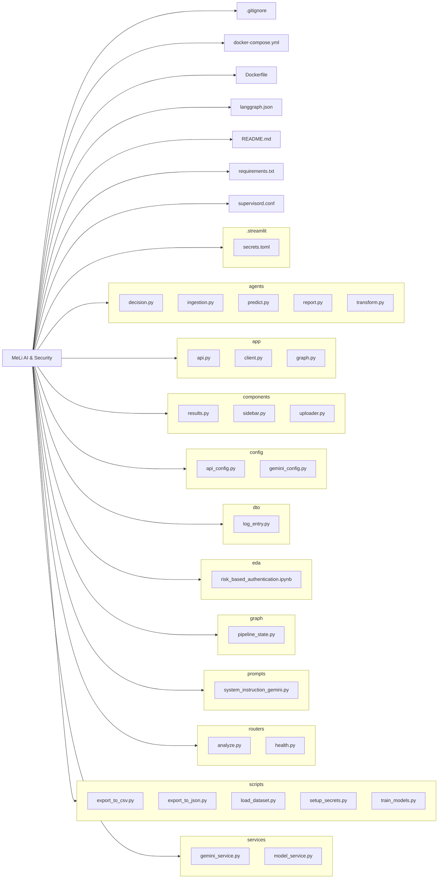
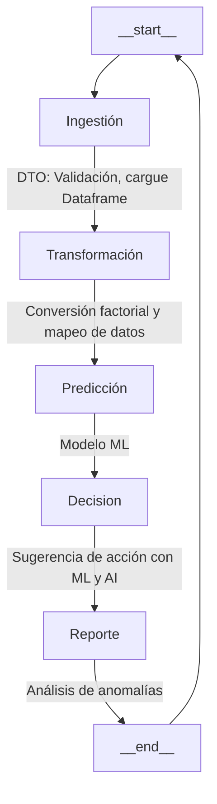
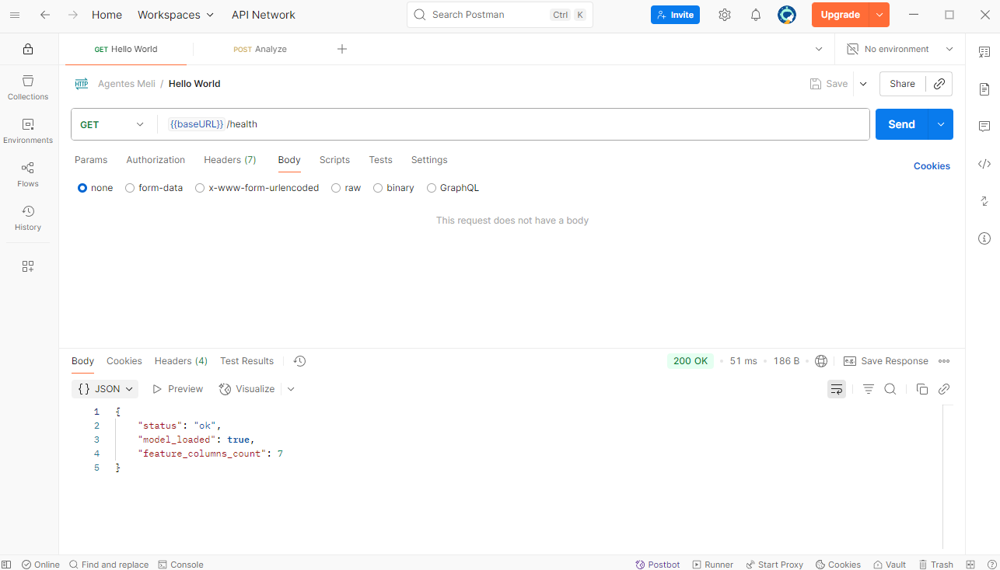
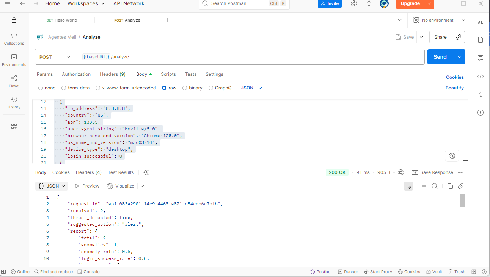
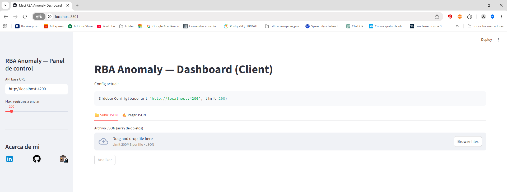
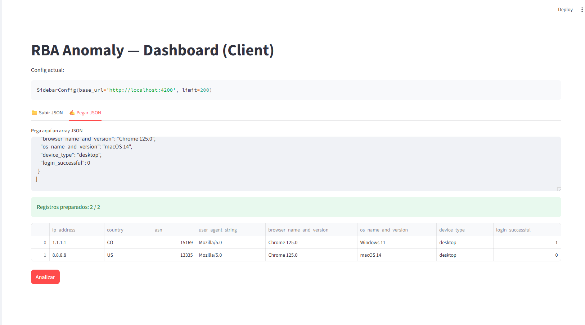
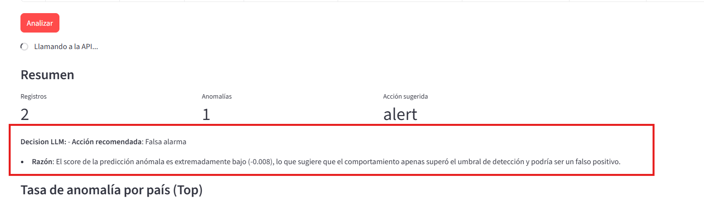
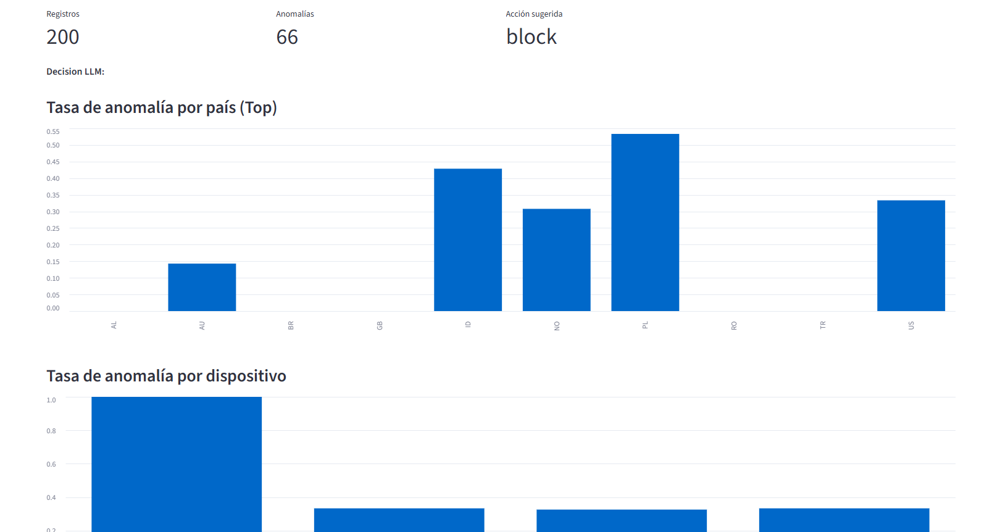
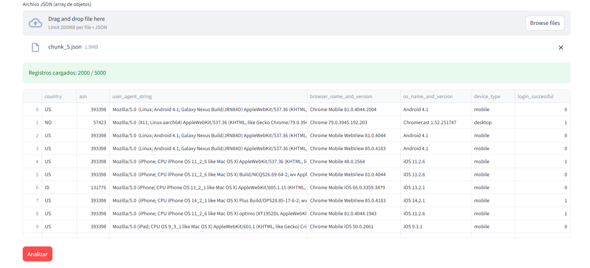

# Reto técnico MeLi: Proposta Desafio - Desenvolvedor - IA

---

# Stack - Technology

[](https://www.langchain.com/langgraph)
[](https://scikit-learn.org/)
[](https://www.python.org/)
[](https://docs.streamlit.io/)
[](https://fastapi.tiangolo.com/)
[](https://jupyter.org/)
[](https://www.docker.com/)
[](https://gemini.google.com/)

---

# Arquitectura del proyecto

## Grafo de arquitectura



## Descripción de carpetas y archivos

- **.streamlit/** → Configuración de Streamlit, incluye `secrets.toml`.
- **agents/** → Agentes inteligentes:
    - [decision.py](agents%2Fdecision.py) Agentes de decisión, tiene conexión a un LLM.
    - [ingestion.py](agents%2Fingestion.py) Agentes carga y validación de los datos entrantes.
    - [predict.py](agents%2Fpredict.py) Agentes de predicción, predice los datos entrantes con base en el modelo
      entrenado.
    - [report.py](agents%2Freport.py) Agentes de reporte, genera un reporte con base en los datos entrantes.
    - [transform.py](agents%2Ftransform.py) Agentes de transformación, convierte los datos entrantes para poder ser
      usados en el modelo.
- **app/** → Código principal de la aplicación y endpoints FastAPI.
    - [api.py](app%2Fapi.py) App FastApi
    - [client.py](app%2Fclient.py) App Streamlit
    - [graph.py](app%2Fgraph.py) App LangGraph
- **components/** → Componentes reutilizables para la interfaz.
    - [results.py](components%2Fresults.py) Componente de resultados, muestra decisiones sugeridas, gráfica y listas.
    - [sidebar.py](components%2Fsidebar.py) Componente de sidebar, panel de control y about me.
    - [uploader.py](components%2Fuploader.py) Componente de subida de datos, archivos json o texto del clipboard.
- **config/** → Configuraciones generales y parámetros de modelos.
    - [api_config.py](config%2Fapi_config.py) Configuración de FastAPI para usar en el app de streamlit.
    - [gemini_config.py](config%2Fgemini_config.py) Configuración de Gemini para usar en los flujos.
- **dto/** → Definición de estructuras de datos (Data Transfer Objects).
    - [log_entry.py](dto%2Flog_entry.py) Mapea y valida los registros entrantes.
- **eda/** → Scripts de análisis exploratorio y limpieza de datos.
    - [risk_based_authentication.ipynb](eda%2Frisk_based_authentication.ipynb) Análisis exploratorio de datos.
- **graph/** → Definición de recursos para LangGraph.
  - [pipeline_state.py](graph%2Fpipeline_state.py) Configuración y estado del grafo de LangGraph.
- **prompts/** → Prompts para IA utilizados por los agentes.
  - [system_instruction_gemini.py](prompts%2Fsystem_instruction_gemini.py) Prompt para Gemini.
- **routers/** → Endpoints API expuestos mediante FastAPI.
  - [analyze.py](routers%2Fanalyze.py) Ruta para análisis de datos (entrada de datos).
  - [health.py](routers%2Fhealth.py) Ruta para validar healthcheck del API.
- **scripts/** → Scripts auxiliares (descarga de dataset, train, etc.).
  - [export_to_csv.py](scripts%2Fexport_to_csv.py) Script para exportar datos a CSV (datos de entrenamiento).
  - [export_to_json.py](scripts%2Fexport_to_json.py) Script para exportar datos a JSON (datos de prueba).
  - [load_dataset.py](scripts%2Fload_dataset.py) Script para descargar datos y preprocesarlos.
  - [setup_secrets.py](scripts%2Fsetup_secrets.py) Script para configurar variables de entorno.
  - [train_models.py](scripts%2Ftrain_models.py) Script para entrenar modelos de ML.
- **services/** → Lógica de negocio, modelos y predicción de anomalías con Gemini.
  - [gemini_service.py](services%2Fgemini_service.py) Servicio para sugerencias con Gemini.
  - [model_service.py](services%2Fmodel_service.py) Servicio para predicción de anomalías con ML.
- [.gitignore](.gitignore) Ignora archivos que no deben ser versionados.
- [docker-compose.yml](docker-compose.yml) Contenerización de la aplicación 1-2.
- [Dockerfile](Dockerfile) Contenerización de la aplicación 1-1.
- [langgraph.json](langgraph.json) Configuración de LangGraph para el flujo de agentes.
- [README.md](README.md) Documentación del proyecto.
- [requirements.txt](requirements.txt) Requisitos del proyecto.
- [supervisord.conf](supervisord.conf) Supervisión de los servicios.


---

# Flujos de agentes


----

# Instalación del proyecto

Esta guía te ayudará a configurar y ejecutar el proyecto de manera rápida y eficiente. Sigue estos pasos para poner
en marcha un entorno de desarrollo robusto, listo para la acción.

## 🛠️ Requisitos

- Windows, macOS o Linux
- Python 3.11 (recomendado) o compatible
- Verifica tu versión:
    - Windows: `py --version` o `python --version`
    - macOS/Linux: `python3 --version` o `python --version`
- Docker (opcional) si prefieres ejecutar todo el sistema de forma integrada y aislada.

⚠️ Nota: Recuerda ejecutar los comandos en la terminal y en la raiz del proyecto.
No uses la terminal (terminal markdown) de este cuaderno⚠️

## 1) 📦 Crear el entorno virtual

Un entorno virtual aísla las dependencias de tu proyecto, evitando conflictos con otras instalaciones
de Python. Es una práctica esencial para un desarrollo limpio.

En la raíz del proyecto, ejecuta:

```bash
python -m venv .venv
```

## 2) ▶️ Activar el entorno virtual

Activar el entorno te permitirá usar las librerías específicas del proyecto.
El comando varía según tu sistema operativo y el shell que uses:

- Windows (PowerShell):
  ```powershell
  .\.venv\Scripts\Activate.ps1
  ```
- Windows (CMD):
  ```cmd
  .venv\Scripts\activate.bat
  ```
- macOS/Linux (Bash/Zsh):
  ```bash
  source .venv/bin/activate
  ```
- macOS/Linux (Fish):
  ```fish
  source .venv/bin/activate.fish
  ```

## 3) 🐍 Verificar la versión de Python del entorno

Una vez activado el entorno, confirma que estás utilizando el intérprete correcto:

Windows

```bash
.\.venv\Scripts\python.exe --version
```

macOS/Linux

```bash
.venv/bin/python --version
```

## 4) ⚙️ Actualizar pip

```bash
python -m pip install --upgrade pip
```

## 5) ✨ Instalar dependencias

Con tu entorno activo y pip actualizado, instala todas las librerías necesarias para que el proyecto funcione
correctamente.
Estas se encuentran listadas en el archivo requirements.txt.

```bash
pip install -r requirements.txt
```

## 6) 🔑 Configurar variables de entorno

Para que la aplicación se conecte con las herramientas y servicios necesarios,
necesitas configurar tus claves y variables. Crea el archivo `.streamlit/secrets.toml`
con la siguiente información, sustituyendo `<tu_api_key>` con tu clave de API de Gemini.

Ejecuta el siguiente script para crear el archivo:

```bash
python -m scripts.setup_secrets
```

Reemplaza `<tu_api_key>` con tu clave de API de Gemini.

## 7) 🦾 Ejecutar scripts para descargar y preprocesar los datos

Ejecuta estos scripts para preparar el proyecto. El proceso descarga y limpia el conjunto de datos,
y luego entrena los modelos de IA, dejándolos listos para ser utilizados por la API.

```bash
python -m scripts.load_dataset
python -m scripts.train_models
```

Nota: Esto genera varios archivos en la carpeta  `data` que pueden ser usados para
probar la aplicación.

---

# Ejecutar aplicaciones

Aquí ya puedes probar tus aplicaciones. Tienes varias opciones para ejecutar los distintos componentes
del proyecto, según tu preferencia:

- Ejecutar de forma individual el API, el cliente y los agentes. Puedes levantar cada aplicación de forma separada,
  para pruebas más controladas y ajustes que desees aplicar.

- Ejecutar todo el sistema de forma dockerizada, ya sea:

    - Todo en un único contenedor y una instancia, si prefieres una ejecución integrada.
    - Por contenedor separando cada app en una instancia.

Esto te permite flexibilidad para realizar pruebas según el entorno o flujo que necesites validar.

⚠️ Independientemente de la opción que elijas, es importante que utilices un entorno virtual para ejecutar los comandos.

⚠️ Además, si decides probar dos opciones al mismo tiempo, no deben ejecutarse simultáneamente,
ya que los puertos son los mismos y se generará un conflicto.

## 🐳 Opción 1: Dockerización (recomendada para pruebas y producción)

Para ejecutar las aplicaciones dentro de contenedores Docker, hay dos maneras de hacerlo:

### 1) Dockerfile para Streamlit + FastAPI (Parecido a ejecutar todo en una sola máquina)

Esto ejecuta el archivo `Dockerfile` con la configuración de `supervisord.conf`
para iniciar tanto FastAPI como Streamlit **_en un solo contenedor y una sola máquina_**.

```bash
docker build -t rba-anomaly-dashboard .
```

Luego ejecuta

```bash
docker run -p 8501:8501 -p 4200:4200 rba-anomaly-dashboard
```

### 2) Docker compose para Streamlit + FastAPI (Parecido a ejecutar cada app en instancias)

Esto ejecuta el archivo `docker-compose.yml` para iniciar un contenedor con FastAPI y Streamlit
**_en un solo contenedor y dos instancias_**.

```bash
docker-compose build
```

Luego ejecuta

```bash
docker-compose up -d
```

Nota: El API cambia ligeramente con esta opción en tu máquina local, el url es http://fastapi:4200/

## Opción 2: Ejecutar de manera individual (recomendada para pruebas y desarrollo)

### 1) 🌐 Ejecutar la API (individual)

Con el entorno virtual activo, puedes lanzar el servidor de la API.
Esta es la parte central del proyecto, que manejará la lógica de la aplicación.

```bash
uvicorn app.api:app --reload --port 4200
```

### 2) 🖥️ Ejecutar la aplicación cliente (individual)

Abre una nueva ventana de tu terminal, asegúrate de que el entorno virtual esté activo y ejecuta el cliente de
Streamlit.
Aquí es donde verás la interfaz de usuario.

```bash
streamlit run app/client.py
```

Nota: Es crucial que utilices el entorno virtual para este comando.

### 3) (Opcional) 🧠 Ejecutar langgraph para analizarlo el flujo de agentes (individual)

Si quieres explorar el flujo de agentes de la IA, ejecuta este comando. Te permitirá visualizar cómo está construido el
grafo, qué datos se necesitan y cómo se comunican los agentes entre sí.

```bash
langgraph dev
```

---
# Pruebas: Demostración del funcionamiento de las apps

Una vez tengas corriendo las aplicaciones por cualquiera de las tres opciones anteriores, llega el momento de probar, para ello
ejecuta las siguientes peticiones en postman o por la consola.

Recuerda que si usaste docker en la segunda opción cambia el dominio
por `http://fastapi:4200` por ejemplo: `http://fastapi:4200/health`

```bash
curl --location 'http://localhost:4200/health'
```

```bash
curl --location 'http://localhost:4200/analyze' \
--header 'Content-Type: application/json' \
--data '[
  {
    "ip_address": "1.1.1.1",
    "country": "CO",
    "asn": 15169,
    "user_agent_string": "Mozilla/5.0",
    "browser_name_and_version": "Chrome 125.0",
    "os_name_and_version": "Windows 11",
    "device_type": "desktop",
    "login_successful": 1
  },
  {
    "ip_address": "8.8.8.8",
    "country": "US",
    "asn": 13335,
    "user_agent_string": "Mozilla/5.0",
    "browser_name_and_version": "Chrome 125.0",
    "os_name_and_version": "macOS 14",
    "device_type": "desktop",
    "login_successful": 0
  }
]
'
```
Por otro lado, puedes acceder desde tu navegador al siguiente dominio http://localhost:8501/
para probar el dashboard.


### Prueba validación del API


### Ejecución de detección de anomalías via API


### Vista inicial del dashboard interactivo


### Ingresando datos desde el clipboard


### Respuesta generada por el LLM


### Resultados obtenidos de la predicción del Modelo de ML 


### Datos cargados en memoria, preparados para analizarse
